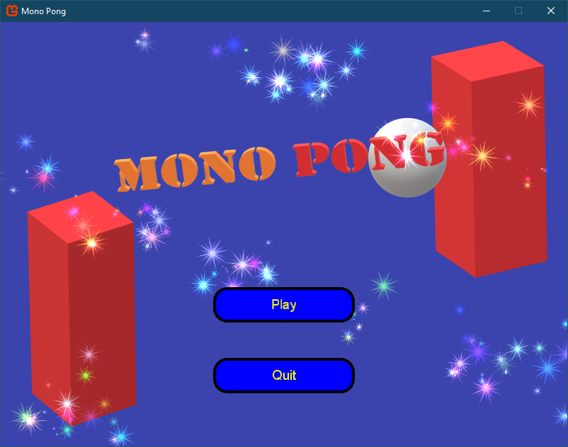
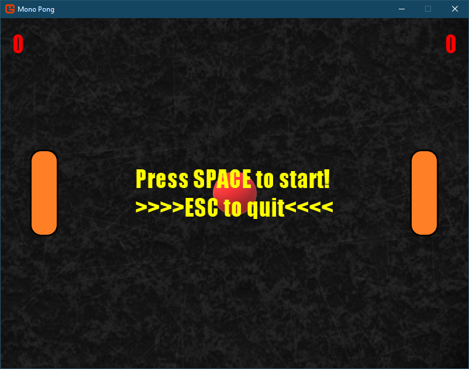
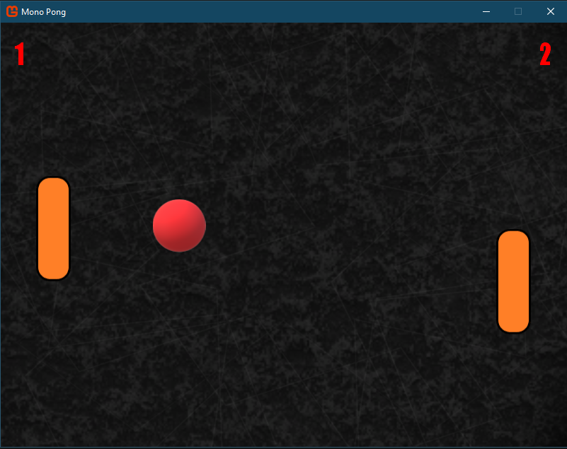
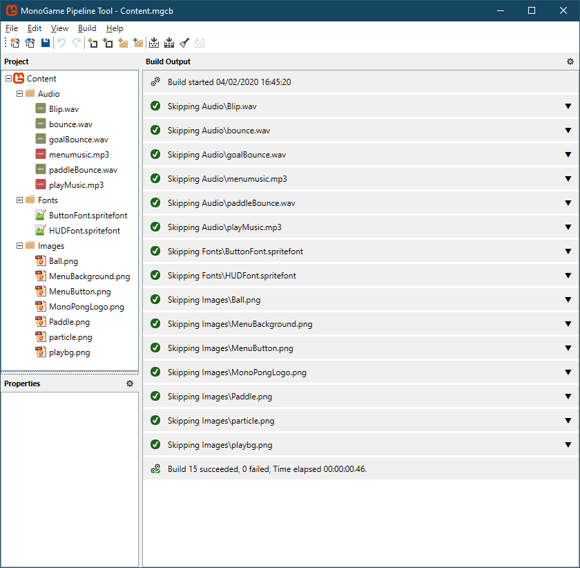

# MonoPong

This tutorial will guide you into making a Pong clone with Arta2D Engine! Before starting, have a look at how the full game will look like:




## Create the Project
The first thing to do is to have Monogame properly installed. Arta2D Engine uses the Monogame framework and thus it needs it to be correctly installed. Also, you will need the Templates for your Visual Studio version (or what you will be working with). I'm assuming the above is already set, so you can choose the "Monogame Windows Project" template, which is a Monogame for the Windows Desktop platform using DirectX.

After you created the project, you need to add the reference to the Arta2DEngine. To do so, right click on the "References" item under your project and click "Add Reference". 
If you have downloaded the release DLL (or compiled one yourself), you will need to click the Browse button and select the DLL (which you also will need to distribute in your compiled game).
If you want to have the source of the engine available to you, then you need to git clone the Arta2DEngine and add this project to your solution. At that point, you will find the "Arta2DEngine" reference in the Projects tab. Select it and click OK.

## Creating the Skeleton
We're going to use Arta2DEngine.Utils.SceneManager to handle the two screens of our game. The MenuScreen, which will contain the main menu shown earlier:

And the actual play screen:


Add a new class and call it:
```c
MenuScreen.cs
```

In the using statements, put the below:
```c
using System;
using System.Collections.Generic;
using Arta2DEngine.Utils.SceneManager;
using Microsoft.Xna.Framework;
using Microsoft.Xna.Framework.Content;
using Microsoft.Xna.Framework.Graphics;
using Arta2DEngine.Graphics.UI;
using Arta2DEngine.Utils;
using Arta2DEngine.Graphics.ParticleEngine;
using Arta2DEngine.Audio;
using Microsoft.Xna.Framework.Media;
using Microsoft.Xna.Framework.Audio;
```

This MenuScreen is going to be an extension of the GameScreen class, so change the class declaration as:
```c
 class MenuScreen : GameScreen
```

We will need several fields, but let's begin with the most important ones:
```c
// Fundamental Objects
ContentManager Content;
SpriteBatch spriteBatch;
Viewport viewPort;
```

The first two are needed to load resources from our Content pipeline and to draw them, while the third one is used to have a viewport to get the window's width and height for positioning reasons.

Let's now create our constructor:
```c
public MenuScreen()
{
       
}
```

It's empty for now, but it will have some variables initialization later. In order to have a functioning GameScreen, we need to implement some Fundamental functions. Let's do so now:
```c
public override void LoadContent()
{
    // Setup the ContentManager and the related root folder.
    if (Content == null)
        Content = new ContentManager(ScreenManager.Game.Services, "Content");

    // Set the viewport for ease of access
    this.viewPort = ScreenManager.Game.GraphicsDevice.Viewport;     
    
    // Show mouse cursor            
    ScreenManager.Game.IsMouseVisible = true;

    // Set Window Title
    Utils.SetWindowTitle(ScreenManager.Game.Window, "Mono Pong");
}

public override void UnloadContent()
{
    Content.Unload();
}

public override void Update(GameTime gameTime)
{
    base.Update(gameTime);
}

public override void Draw(GameTime gameTime)
{
    // Set the spriteBatch if needed
    if (spriteBatch == null)
        spriteBatch = ScreenManager.SpriteBatch;
}
```

Now, the skeleton for the MainScreen.cs file is done. It's time to go back to the Game1.cs (I will call it "MainGame.cs" as I have renamed it, but feel free to keep it Game1.cs if you want). You should basically remove most of the preliminary code for it. Make sure to put the correct using statements:
```c
using Microsoft.Xna.Framework;
using Arta2DEngine.Utils.SceneManager;
```
Basically we will be using tghe Arta2DEngine SceneManager and of course the XNA framework (monogame).

Then, we need to create a couple of fields:
```c
 // Fundamental Objects
GraphicsDeviceManager graphics;
ScreenManager screenManager;

// Screen Resolution
const int BufferWidth = 800;
const int BufferHeight = 600;
```
We're basically setting the resolution to 800x600 for our game. Then, in the MainGame() (or Game1) constructor, we set up a couple of things:
```c
public MainGame()
{
    // Setup the GraphichDeviceManager and Content
    graphics = new GraphicsDeviceManager(this);
    Content.RootDirectory = "Content";

    // Setup resolution
    graphics.PreferredBackBufferWidth = BufferWidth;
    graphics.PreferredBackBufferHeight = BufferHeight;

    // Create the screen manager component.
    screenManager = new ScreenManager(this);

    // Add the screen manager to the Components.
    Components.Add(screenManager);

    // Activate the first screen (the enter point of the game).
    screenManager.AddScreen(new MenuScreen());
}   
```
The most important thing here is the SceneManager initialization. We create a ScreenManager (passing "this" as argument, so the MainGame variable holding everything togheter) and add it to the Components, a list that includes everything that needs to be drawn. Lastly and most importantly, we add the first screen we want to show: the MenuScreen, passing as an argument its constructor.

MainGame.cs is practlycally completed and we don't need to change this anymore. We can now concentrate our efforts directly on the GameScreens, MenuScreen (for which we have created the skeleton already) and later the actual PlayScreen.

## Creating the MenuScreen
Coming back to the MenuScreen, let's fill up the Fields we're going to need. 
```c
// Fundamental Objects
ContentManager Content;
SpriteBatch spriteBatch;
Viewport viewPort;

// Menu Buttons
private Button playButton;
private Button quitButton;

// Text Labels        
private string playText;
private string quitText;

// Menu Positions
private Vector2 titlePos;
private Vector2 playButtonPos;
private Vector2 quitButtonPos;

// Fonts
private SpriteFont buttonFont;

// Textures 2D
private Texture2D buttonTexture;
private Texture2D titleTexture;
private Texture2D backgroundTexture;

// Audio
private BGM mainMenuMusic;
private SFX mouseOverSFX;

// Colors
private Color buttonFontColor, buttonBackColor, buttonHoverColor;

// Particle Engine
ParticleEngine particleEngine;
```

Most of them are pretty much clear, but let's go over them:
* **Menu Buttons**: These will hold the Buttons (Button class from the Arta2DEngine.Graphics.UI module) for our main menu.
* **Text Labels**: These will hold the strings we're going to use for the button text.
* **Menu Positions**: These will hold the Vector2 to store the position of various UI elements.
* **Fonts**: This holds the spritefont used for the button text.
* **Textures 2D**: The texture for our button, title and background.
* **Audio**: The sound effect (SFX) and song (BGM) for the menu screen.
* **Colors**: Colors used for the button backcolor, forecolor and hover color.
* **ParticleEngine**: The particle engine used for the menuscreen effect.

As I said, pretty much self explanatory. Before going forward, let's double click our Content.mgcb file inside Visual Studio to open the MonoGame Pipeline Tool. We'll need to import all our game resource. Rather than go one by one, let's import everything in. Follow the folder structure and naming structure as the below screenshot:

We basically have three folders:
* **Audio**: This will hold our sound effects and music.
* **Fonts**: This will hold two sprite fonts for UI purposes.
* **Images**: This will hold the images and sprites.

You can basically put whatever you want in here as all the drawing code will take account of the size of the items (albeit having paddles too big will definitely make the game less interesting), but feel free to take the resources from [this archive](../Documentation/resources/monopong_resources.7z).

Let's now go back to our MenuScreen constructor:
```c
public MenuScreen()
{
    // Labels & Text Setup            
    playText = "Play";
    quitText = "Quit";            

    // Color Setup
    buttonFontColor = Color.Yellow;
    buttonBackColor = Color.Blue;
    buttonHoverColor = Color.CornflowerBlue;            
}
```

Here we setup the strings for the buttons Play and Quit and we change the colors for font, background and hover of the buttons. You can put whatever you like here!

Logically, now let's take care of the "Funtamental" functions which are the LoadContent, UnloadContent, Update and finally Draw. Note that these fundamental functions are the base of any Monogame application!

Let's start with **LoadContent()**:
```c
public override void LoadContent()
{
    // Setup the ContentManager and the related root folder.
    if (Content == null)
        Content = new ContentManager(ScreenManager.Game.Services, "Content");

    // Set the viewport for ease of access
    this.viewPort = ScreenManager.Game.GraphicsDevice.Viewport;

    // Background Texture
    backgroundTexture = Content.Load<Texture2D>("Images/MenuBackground");

    // Initialize Button Texture
    buttonTexture = Content.Load<Texture2D>("Images/MenuButton");

    // Initialize Font
    buttonFont = Content.Load<SpriteFont>("Fonts/ButtonFont");

    // Ttile Logo
    titleTexture = Content.Load<Texture2D>("Images/MonoPongLogo");
    titlePos = new Vector2(viewPort.Width / 2 - titleTexture.Width / 2, 50 + titleTexture.Height / 2);          

    // Play Button position            
    playButtonPos = new Vector2(viewPort.Width / 2 - buttonTexture.Width / 2, viewPort.Height / 2 - buttonTexture.Height / 2 + 100);

    // Quit Button position            
    quitButtonPos = new Vector2(viewPort.Width / 2 - buttonTexture.Width / 2, viewPort.Height / 2 - buttonTexture.Height / 2 + 200);

    // Button Initialization
    playButton = new Button(buttonTexture, buttonFont, buttonFontColor, buttonBackColor, buttonHoverColor);
    playButton.Text = playText;
    playButton.Position = playButtonPos;
    playButton.Click += PlayButton_Click;
    playButton.MouseOver += Button_MouseOver;

    quitButton = new Button(buttonTexture, buttonFont, buttonFontColor, buttonBackColor, buttonHoverColor);
    quitButton.Text = quitText;
    quitButton.Position = quitButtonPos;
    quitButton.Click += QuitButton_Click;
    quitButton.MouseOver += Button_MouseOver;

    // Load the particles and then initalize the ParticleEngine
    List<Texture2D> textures = new List<Texture2D>();
    textures.Add(Content.Load<Texture2D>("Images/particle"));
    DefaultParticleEffect defaultEffect = new DefaultParticleEffect(5,0.15f);
    particleEngine = new ParticleEngine(textures, Vector2.Zero, defaultEffect, false);

    // LOAD AUDIO
    mainMenuMusic = new BGM(Content.Load<Song>("Audio/menumusic"), 0.7f);
    mainMenuMusic.Play(true);

    mouseOverSFX = new SFX(Content.Load<SoundEffect>("Audio/Blip"), 1.0f, 0.0f, 0.0f);

    // Show mouse cursor            
    ScreenManager.Game.IsMouseVisible = true;

    // Set Window Title
    Utils.SetWindowTitle(ScreenManager.Game.Window, "Mono Pong");
}
```

It's quite long, as we're loading several resources and creating a lot of items, but it's quite self explanatory. We load a Background texture, we initialize the button texture to be used for buttons, the font for them, we load the "MONO PONG" logo texture and position them using the Viewport to obtain the window width and height. Then we initalize thetwo buttons, and add the events to which they willrespond (both for Click event and MouseOver event). Then we create a list that will hold textures for our particles (we'll add only one though) and then create a DefaultParticleEffect composed of 5 particles scaled by 0,15 since our particle image is quite big. Then we initialize our ParticleEngine passing this particle effect. The effect itself is pretty basic, it simply spawns 5 (in our case) randomly rotating and moving particles! We then load the audio for BGM (and start the music) and SFXs. Everything here should be hopefully easy enough to grasp.

Next the **UnloadContent()**:
```c
public override void UnloadContent()
{
    // Stop and unload the music
    mainMenuMusic.Stop();
    mainMenuMusic = null;

    Content.Unload();
}
```
This is very easy, it simply stops the music, unload it and then call Content.Unload() to unload everything else we loaded in the LoadContent()! Pretty easy.

The **Update()** method is just as short:
```c
public override void Update(GameTime gameTime)
{
    base.Update(gameTime);

    // Update the Particles
    particleEngine.EmitterLocation = RandomizeParticleEmitterPosition(particleEngine);
    particleEngine.Update();

    // Update Buttons
    UpdateButtons(gameTime);
}
```
Firstly, we randomize the position of the ParticleEmitter in order to have the particles spawn everywhere. The actual method will be implemented below so don't worry about it for now. Then we Update() the particle Engine so that it can work its magic. Lastly we call a method that will update all the buttons. We'll create it later too.

Lastly, the elephant in the room: the **Draw()** method:
```c
public override void Draw(GameTime gameTime)
{
    // Set the spriteBatch if needed
    if (spriteBatch == null)
        spriteBatch = ScreenManager.SpriteBatch;

    // Set the background
    ScreenManager.GraphicsDevice.Clear(ClearOptions.Target, Color.CornflowerBlue, 0, 0);

    // DRAW BEGIN
    spriteBatch.Begin();

    // Draw Background
    spriteBatch.Draw(backgroundTexture, new Vector2(0, 0), Color.White);

    // Draw Title
    spriteBatch.Draw(titleTexture, titlePos, Color.White);

    // DRAW END
    spriteBatch.End();

    // Draw Particles
    particleEngine.Draw(spriteBatch);

    // Draw Buttons            
    DrawButtons();
}
```

It's fairly simple too. We load the spriteBatch we're going to use for drawing. Then we clear the screen with a standard color (this is not entirely needed as our background will cover the whole screen). Then we start a Draw cycle and draw the background and the logo. We start (and close) a draw cycle calling particle.Engine.Draw that will take care of drawing all the particles and in the end we call the DrawButtons() method that will take care of drawing each single button. We'll create this method shortly.

Before creating the several methods we discussed, let's go complete the Events that will be used for our buttons.
```c
private void PlayButton_Click(object sender, EventArgs e)
{
   LoadingScreen.Load(ScreenManager, false, new PlayScreen()); // Load the gameplay screen (PlayScreeN)
}

private void QuitButton_Click(object sender, EventArgs e)
{
    // Close the game.
    ScreenManager.Game.Exit();
}

private void Button_MouseOver(object sender, EventArgs e)
{
    // Play a sound effect
    mouseOverSFX.SimplePlay();
}
```

Extremely simple events that will fire when a player clicks on the Play button, the Quit button and finally when he mouse overs. The PlayButton_Click event loads the actual gameplay screen. For now, since we don't have a PlayScreen.cs yet, this won't work so feel free to keep that line commented if you don't want to see compiler errors. The QuitButton_Click events calls the Exit() method from the base Game() stored inside the ScreenManager, while the Button_MouseOver event will play a sound effect.

Finally, the private methods we called during the Update() and Draw():
```c
 private void UpdateButtons(GameTime gameTime)
{
    playButton.Update(gameTime);
    quitButton.Update(gameTime);
}

private void DrawButtons()
{
    spriteBatch.Begin();
    playButton.Draw(spriteBatch);
    quitButton.Draw(spriteBatch);
    spriteBatch.End();
}

private Vector2 RandomizeParticleEmitterPosition(ParticleEngine particleEngine)
{
    // Generate a random
    Random random = new Random();

    // Apply some random jitter to make the enemy move around.
    const float randomization = 1;

    return new Vector2( random.Next(0, viewPort.Width) * randomization,
                        random.Next(0, viewPort.Height) * randomization);            
}
```

Those are quite self explanatory as well. UpdateButtons simply calls Update() for each button. It's there for having a clean Update() function. DrawButtons() does exactly what it says, while the RandomizeParticleEmitterPosition is a little bit more involved. It basically moves the Emitter in a randomized position. The X axis is between 0 and the screen width plus some randomization, and the Y axis again between 0 and the screen height plus randomization. This makes the particles appear all over the screen.

The MainScreen.cs is done!

Go back to the [Readme](../README.md) for Getting Started.
